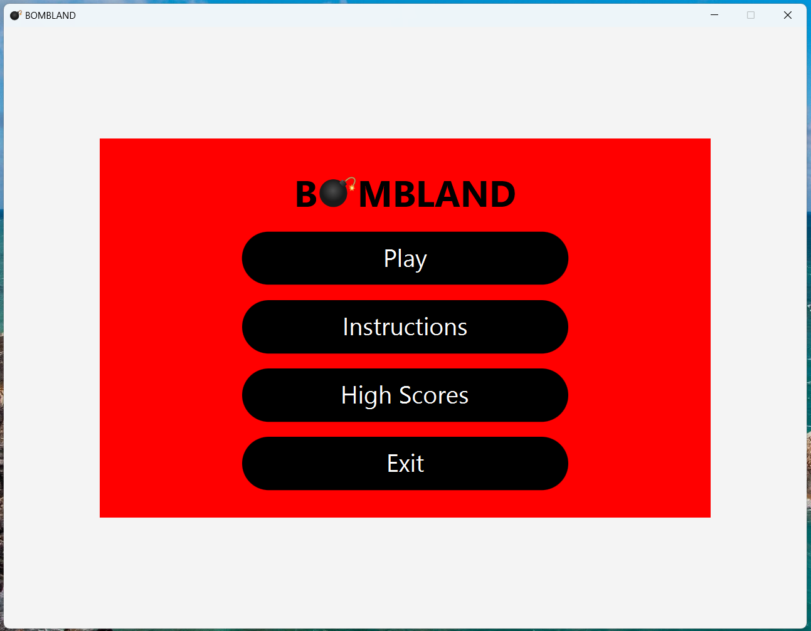
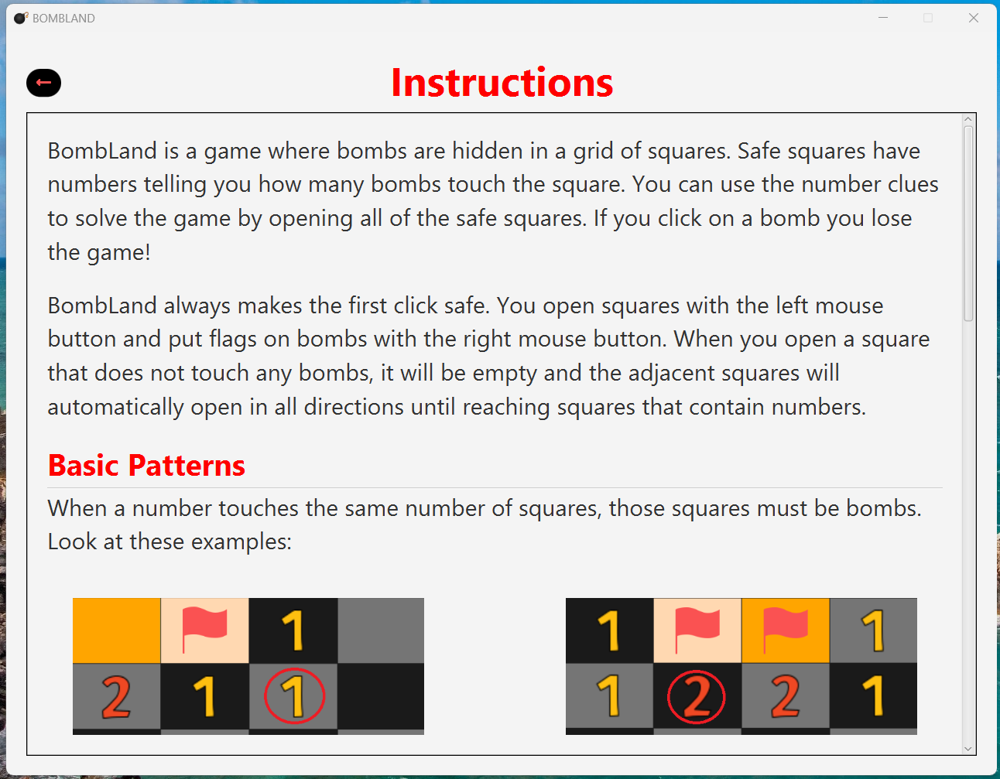
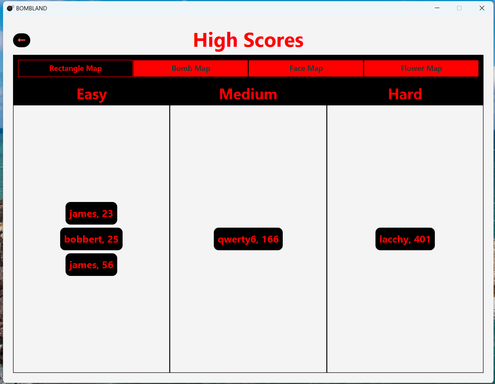
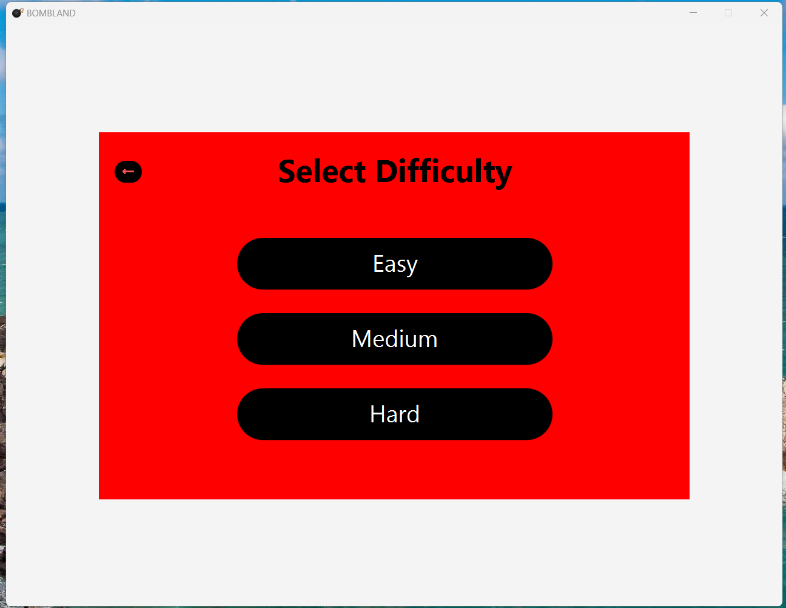
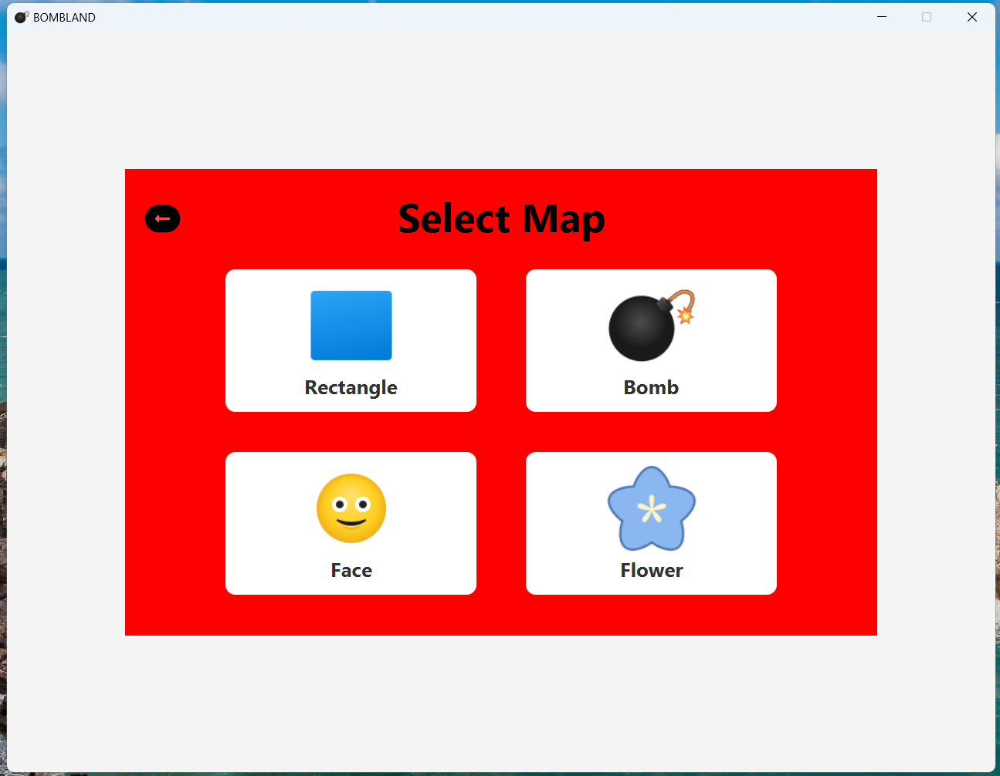
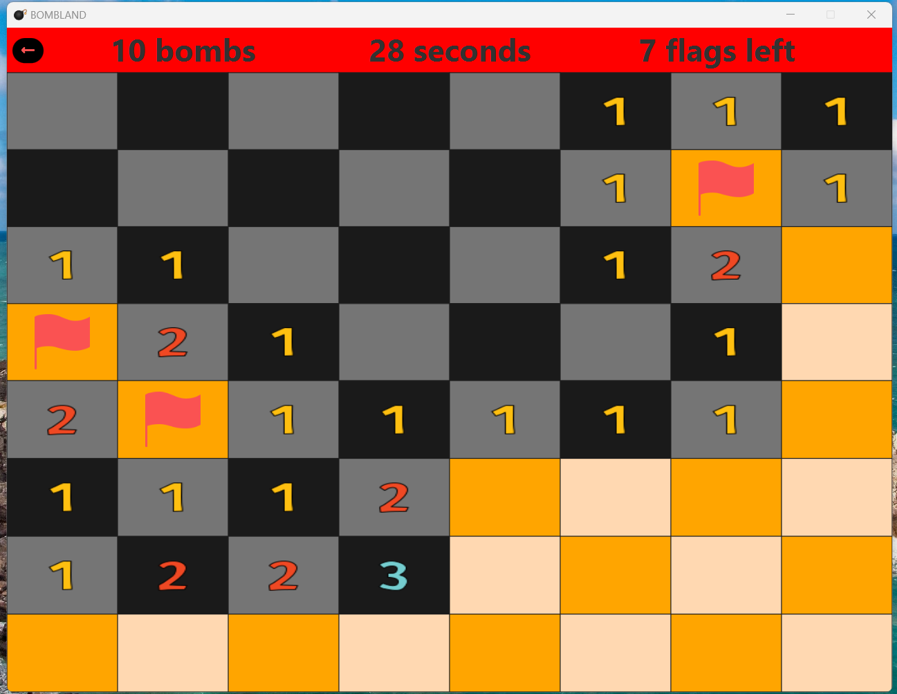
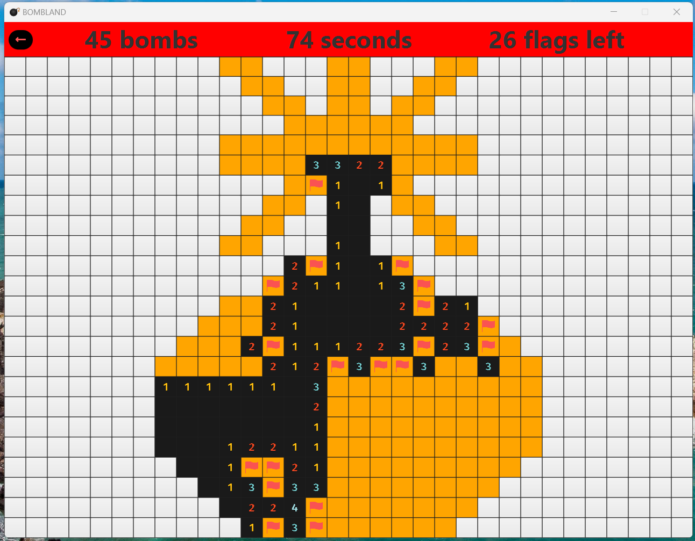
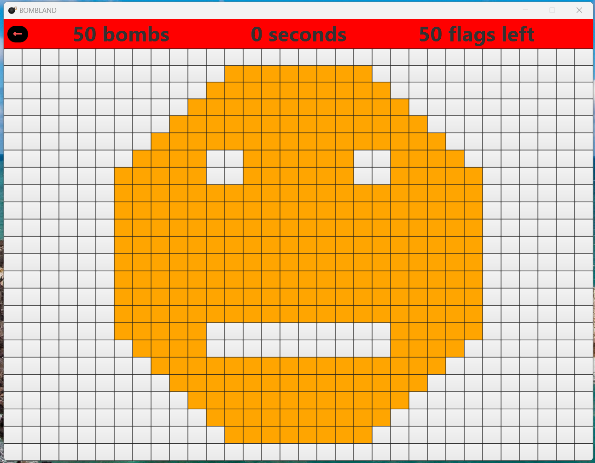
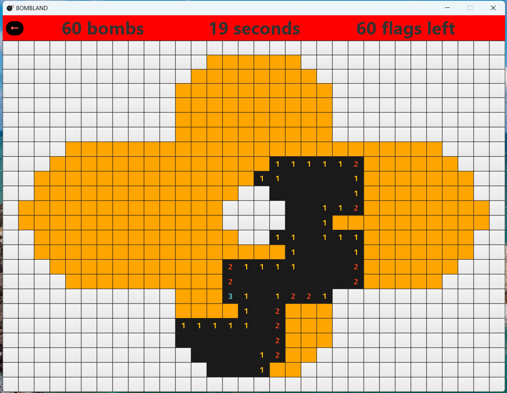

# BOMBLAND

This project started as a clone of the Minesweeper game, but overtime I decided to add more features to it.

## Tech Stack
- Java
- JavaFX (UI Framework)
- DynamoDB
- SQLite
- Maven (build tool)

## Features
- 4 maps to play on
- Multiplayer (you can play against someone else)
- More coming soon!

## Screenshots
Here's a preview of the app:

