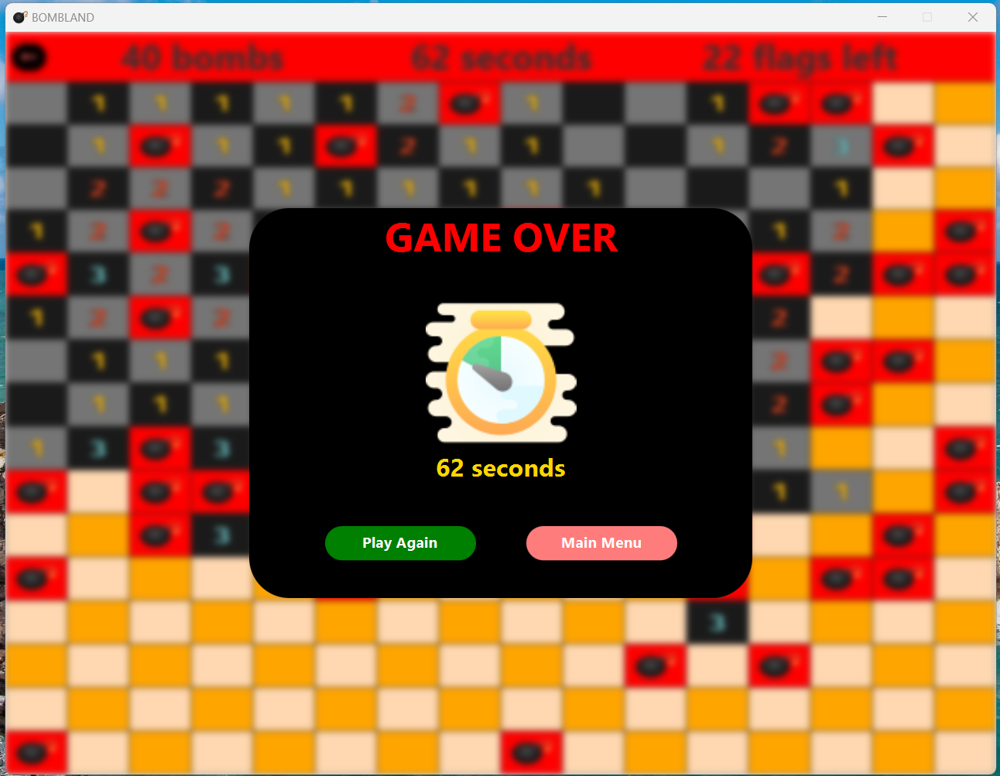

# BOMBLAND
This project started as a clone of the Minesweeper game, but overtime I decided to add more features to it.

## Tech Stack
- Java
- JavaFX (UI Framework)
- DynamoDB (cloud persistence)
- SQLite (local caching)
- Maven (build tool)

## Features
- 4 maps to play on
- Multiplayer (you can play against someone else)
- More coming soon!

## Screenshots

## Installation Instructions
For a pre-built executable, please download the **EXE_FOLDER** zip file from the Release Page, and run the BOMBLAND.exe file.